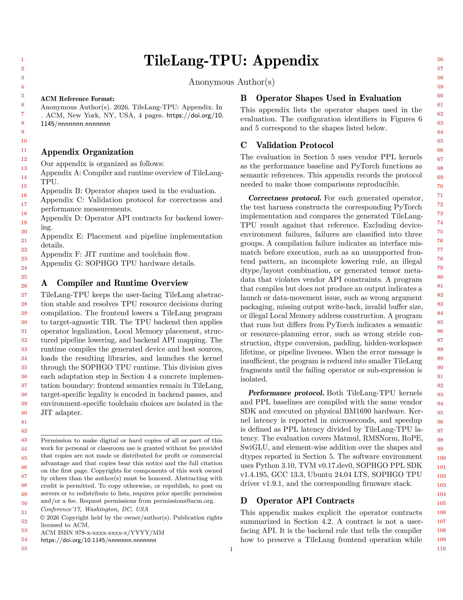
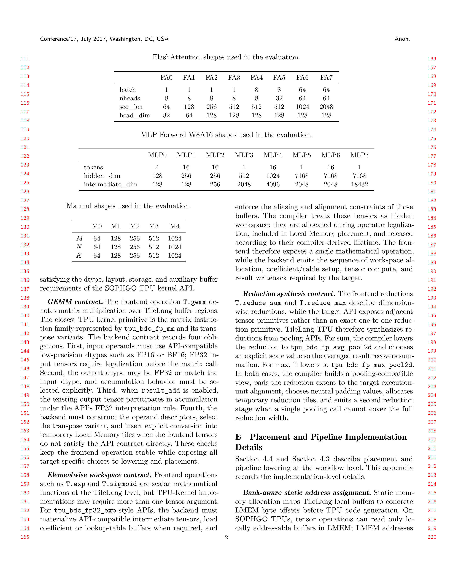
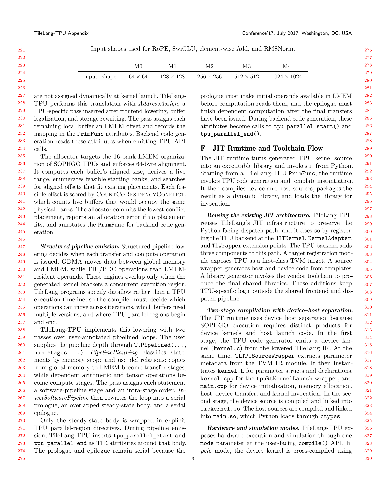
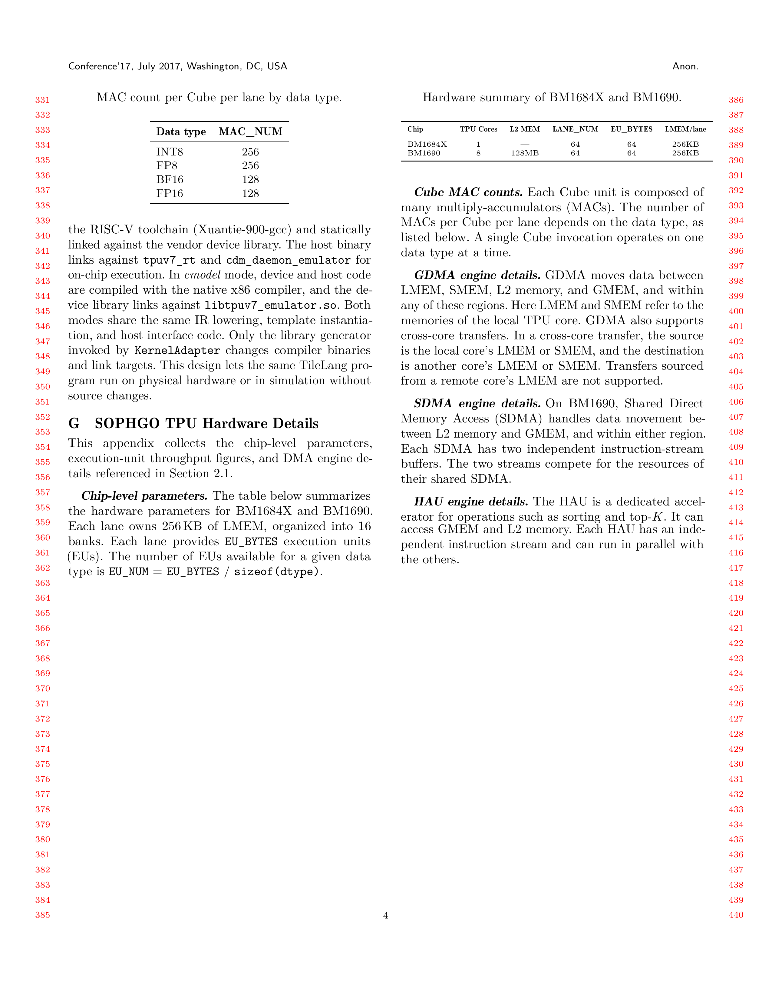

## Paper Appendix

The full appendix is shown below.






# Practical: Retargeting AI Kernel DSLs Beyond GPUs: An Experience Report on Refactoring TileLang to Sophgo TPUs

This repository contains the TileLang-TPU artifact for the paper above. TileLang-TPU retargets the TileLang AI kernel DSL from GPU-oriented execution to SOPHGO BM1690 TPUs, including TPU lowering, code generation, JIT host/device wrapper generation, PCIe execution, cmodel execution, and benchmark reproduction scripts.

## Artifact Review Entry

Use [artifact/README.md](./artifact/README.md) as the canonical artifact guide. It contains the install commands, smoke tests, BM1690 PCIe reproduction commands, cmodel correctness-only path, expected claims, result parsers, and manifest checks.

| Reader goal | Start here |
|---|---|
| Run the artifact | [artifact/README.md](./artifact/README.md) |
| Read artifact metadata | [ARTIFACT.md](./ARTIFACT.md) |
| Check submission appendix | [Paper Appendix](#paper-appendix) |
| Inspect benchmark matrices | [artifact/configs/](./artifact/configs/) |
| Inspect expected claims | [artifact/expected/paper_claims.json](./artifact/expected/paper_claims.json) |

Quick smoke commands:

```bash
python artifact/scripts/check_env.py --mode cmodel
python artifact/scripts/run_smoke.py --mode cmodel
python artifact/scripts/run_smoke.py --mode pcie
```

`mode="cmodel"` runs through the SOPHGO simulator on a CPU host and validates correctness only. Paper performance numbers require a BM1690 PCIe card.

## Project Summary

TileLang-TPU is a TPU-oriented extension of TileLang for SOPHGO accelerators. It preserves the TileLang Python DSL while adding TPU lowering, TPU code generation, and JIT runtime integration so TileLang kernels can compile and run on TPU platforms.

The current artifact centers on BM1690 and covers:

- `tilelang.compile(..., target="tpu")`
- default PCIe mode and explicit `mode="cmodel"` simulator mode
- TPU DSL intrinsics such as `T.copy`, `T.gemm`, `T.reduce_sum`, `T.reduce_max`, `T.exp`, `T.rsqrt`, and `T.rope_add`
- generated host/device glue code
- standalone operators, fused kernels, and ablation benchmarks used by the paper

## What This Repository Provides

TileLang-TPU is a TileLang-to-TPU compiler and runtime path for SOPHGO accelerators.

- It reuses the TileLang frontend and extends it with TPU-specific lowering, codegen, and JIT support.
- It uses the underlying SOPHGO TPU compilation tools required by the PPL ecosystem, but the artifact evaluates TileLang-TPU as the compiler and scheduling layer.
- It turns TileLang programs into runnable TPU kernels, including host/device wrapper generation and execution flow integration.

## Artifact Claims

| Paper result | Reproduction command |
|---|---|
| Standalone operators | `python artifact/scripts/run_core.py --figure fig4` |
| Fused FlashAttention and MLP W8A16 | `python artifact/scripts/run_core.py --figure fig5` |
| Pipeline/address-allocation ablation | `python artifact/scripts/run_ablation.py` |
| Correctness-only simulator check | `python artifact/scripts/run_smoke.py --mode cmodel` |

The copied paper figures live in [artifact/figures/paper/](./artifact/figures/paper/). The artifact README links each covered figure to its command and expected claim.

## Requirements

PCIe performance reproduction requires:

- SOPHGO BM1690 PCIe TPU card
- Ubuntu 24.04 LTS
- SOPHGO TPU driver v1.9.1 and matching firmware
- SOPHGO PPL SDK v1.4.195
- Python 3.10 or newer
- GCC 13.3 or a compatible compiler
- Xuantie-900 RISC-V toolchain from the SOPHGO/PPL setup

Reviewers without a physical TPU card can use cmodel for correctness-only checks if they have the SOPHGO emulator runtime.

## Quick Setup

The full setup procedure is in [artifact/README.md](./artifact/README.md). The core repository preparation is:

```bash
git submodule update --init --recursive
cp patches/tvm.patch 3rdparty/tvm/tvm.patch
cd 3rdparty/tvm
git apply tvm.patch
cd ../..
./install_tpu.sh
pip install -e . -v
```

Configure the SOPHGO/PPL runtime before running TPU or cmodel paths:

```bash
export PPL_PROJECT_ROOT=/path/to/ppl
export SRC_DIR="$PWD/src/tl_templates/tpu"
export TPU_KERNEL_PATH="$SRC_DIR"
export PPL_KERNEL_PATH="$SRC_DIR/libkernel.so"
export LD_LIBRARY_PATH="/opt/tpuv7/tpuv7-current/lib:${PPL_PROJECT_ROOT}/runtime/bm1690/tpuv7-runtime-emulator/lib:${LD_LIBRARY_PATH}"
```

## Programming Model

TileLang-TPU keeps the TileLang workflow and switches the backend to TPU:

```python
import tilelang

kernel = tilelang.compile(my_kernel, out_idx=-1, target="tpu")
kernel_cmodel = tilelang.compile(my_kernel, out_idx=-1, target="tpu", mode="cmodel")
```

Omitting `mode` selects PCIe mode. Use `mode="cmodel"` only for simulator execution.

## Repository Layout

| Path | Role |
|---|---|
| [artifact/](./artifact/) | Artifact guide, configs, scripts, expected claims, and copied paper figures. |
| [appendix/](./appendix/) | Required paper appendix pages rendered as PNG. |
| [tilelang/](./tilelang/) | TileLang frontend and TPU-facing Python entry points. |
| [src/target/](./src/target/) | TPU codegen and runtime modules. |
| [src/tl_templates/tpu/](./src/tl_templates/tpu/) | TPU code templates and generated host/device artifacts. |
| [tilelang/jit/adapter/](./tilelang/jit/adapter/) | TPU JIT wrapper and library generation flow. |
| [tpu_benchmark/](./tpu_benchmark/) | Benchmark implementations for the paper figures. |
| [tpu_demo/](./tpu_demo/) | Small TPU and cmodel diagnostics. |

## Development Notes

If you modify C++ code, rebuild native components before rerunning demos:

```bash
make -j 10
```

Format the repository with:

```bash
./format.sh
```

## Acknowledgements

TileLang-TPU builds on open-source work from [TileLang](https://github.com/tile-ai/tilelang) and uses the TPU compilation ecosystem associated with [SOPHGO PPL](https://github.com/sophgo/PPL/).
